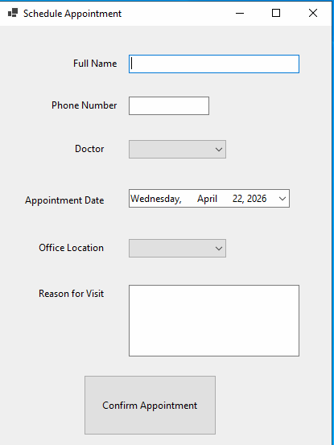

# DentalAppointment

A .NET application to manage dental appointments, patients, and practitioners. 
This repository contains the source for a small clinic scheduling system that 
supports creating appointments.

## Prerequisites

- .NET 10 SDK (https://dotnet.microsoft.com)
- Visual Studio 2026 or VS Code with C# tooling

## Getting started

1. Clone the repository
   git clone https://github.com/JoeProgrammer88/DentalAppointment.git
2. Restore dependencies and build  
   `dotnet restore`   
   `dotnet build`
3. Run the project (from the project folder)  
   `dotnet run`

If you use Visual Studio, open the solution file and run the project.

## Features

- Create appointments

## Screenshots

